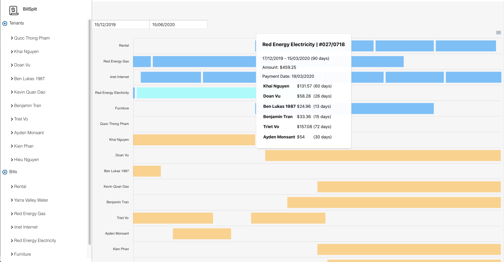

# Bill Split

> An application for managing bills and split them among the tenants

## Motivation

During my university life, I rented a house and share it with my friends. It always gave me a headache everytime I split the bills with them. The main problem is they stayed for different duration during the billing period (some move in, some move out). BillSplit was made to make bill management easy and fun.

## Features
- Managing tenants: Each tenant could have multiple stayed durations (move in and out)
- Splitting bill: Automatically determine which tenants are involved in a bill, and split the amount based on their stayed duration.
- Managing bills: Store information about the bills, as well as how they are splitted.
- Visual presentation: Manage everything from a timeline.

## Technology
- Backend: Using ExpressJS and Firebase Functions as API endpoints.
- Frontend: Using React and BlueprintJS.

## Screenshot

## Demo Splitting Bill

